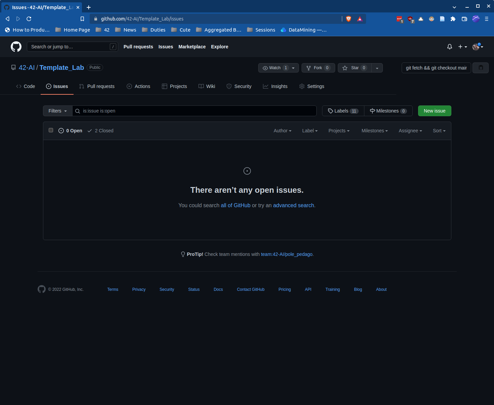
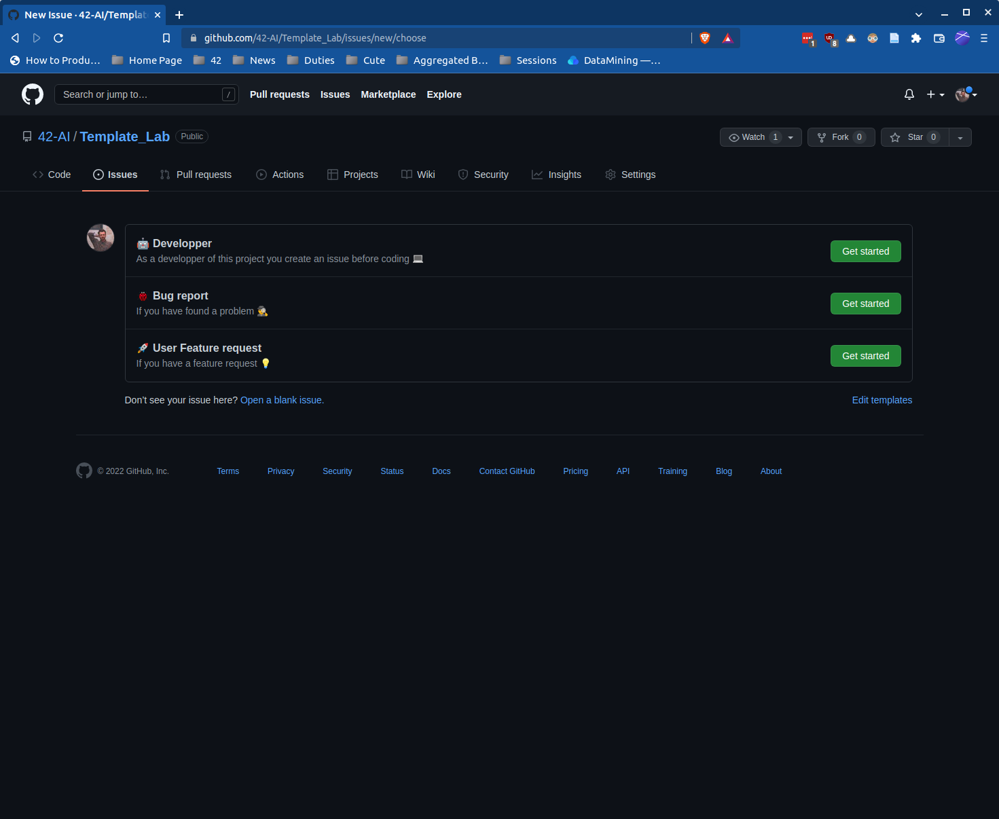
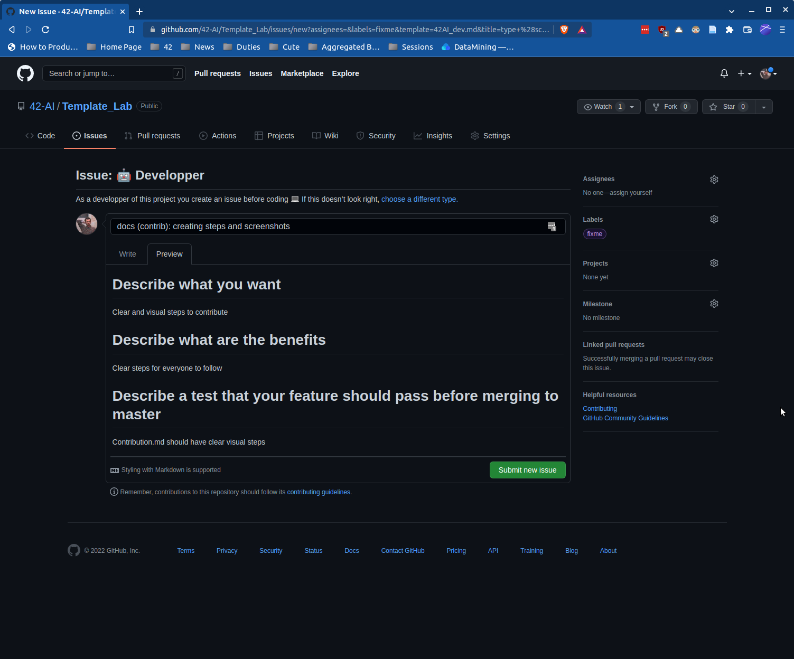
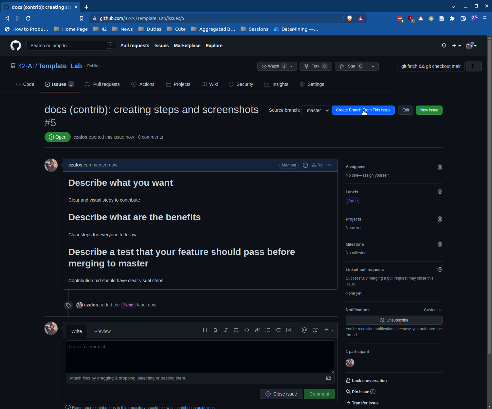
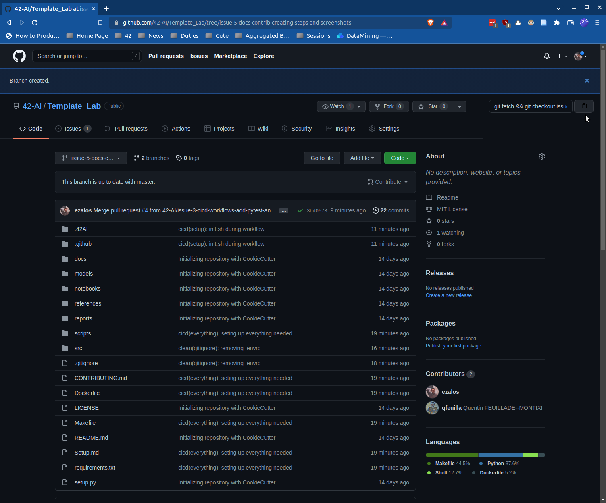
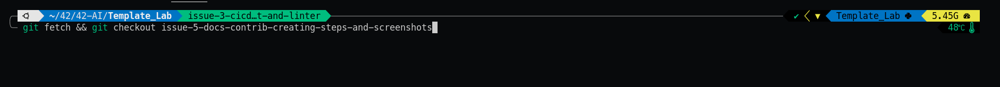

# Hello World 👋

Thank you for contributing to this project 🙏

To keep the code clean 🧹 and organized 🗒️, we'd like you to follow some simple rules 📏 (or your work will not be taken in consideration 😱):

---
# How to contribute

## 1. Create an isssue



## 2. Select the developper issue



## 3. Fill your issue description


## 4. Create a branch from the issue

For this step there is a web pluggin which makes everything easier:
[https://github.com/bumbeishvili/create-branch-from-issue](https://github.com/bumbeishvili/create-branch-from-issue)



## 5. Change your branch and start coding




## 6. Work on it

needs to have successful github actions

## 7. Create a Pull Request


## 8. Assign others to it

## 9. Review the merge request

## 10. Close the issue


---
## ISSUES
When you create an issue, make sure it :
- Says where the issue is, or come from
- Be clear about how to reproduce the issue (with code if possible)

### Furthermore please follow this convention for naming your issues:
```
<type>: your issue message
```
**`<type>`** can be one of the following :
- **cicd**: Changes to the CI/CD
- **docs**: Changes to the documentation
- **feat**: Creation of a new feature
- **fix**: Fix a bug
- **perf**: Changes that only improve performance
- **refactor**: A code change that do not add features or fix a bug 
- **style**: Changes that does not affect the code (white-space, formatting, etc...)
- **test**: Creating a test

---
## COMMITS
Your commit messages must follow [Conventional Commit](https://www.conventionalcommits.org/en/v1.0.0/)
with the same **`<type>`** than in the issues naming convention above 

if your commit solves an issue, you have to reference it with #ISSUE_NB

---
## BRANCHES

There is 3 types of branches:
 - `from-issue`
   - The branch name is created from the issue name
   - These branches are created from `master`
   - It's were we code
   - Once the issue complete they are merged to `master` after a successfull pull request
 - `master`
   - It's were are aggregated the new features
   - It's the only branch from which we can create a pull request to `production`
 - `production`
   - This branch should always be working and ready to use
   - It only accepts pull request from `master`

Your branch name should always refer to the issue it aims to fix.
Always create your branch from the master branch.
You work on your branch.
The CICD needs to be succesful before creating a pull request
Your pull request has to be reviewed and approved before merging to master


---
## MERGE REQUEST
Your merge request should explains clearly what it does.

It should also briefly explain what it changes in the code.

The name of the merge request must follow the same rule as the commit convention (because merge will be turned into commit in master)